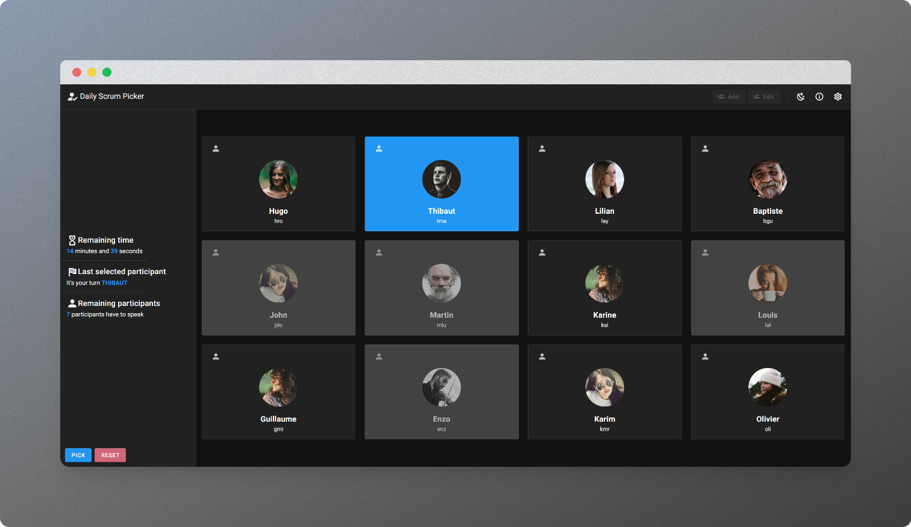

# 👥 Daily Scrum Picker

[](https://daily-scrum-picker.vercel.app)  

**Daily Scrum Picker** is a web application designed to randomly select participants for daily meetings.



## Overview

**Daily Scrum Picker** helps teams to randomly select the order of participants for daily scrum meetings. This ensures a fair and varied speaking order, preventing the same people from starting every time and promoting equal participation among team members.

## Features

- **Random Participant Selection**: Randomly select team members to speak during daily meetings.
- **User-Friendly Interface**: Intuitive and easy-to-use interface.
- **Customizable Settings**: Adjust the list of participants and meeting settings as needed.

## Technologies

This project is built with:

- **Vue.js**: A progressive JavaScript framework for building user interfaces.
- **Vuetify**: A Vue UI Library with beautifully handcrafted Material Components.
- **Vite**: A fast and modern build tool for web projects.
- **Vercel**: A platform for frontend developers, providing the optimal workflow for static sites.
- **GSAP**: A JavaScript library for creating high-performance animations.
- **vee-validate**: A form validation library for Vue.js.
- **Pinia**: A state management library for Vue.js.

## Installation

To set up the project locally, follow these steps:

1. **Clone the repository**:

    ```bash
    git clone https://github.com/ahmosys/daily-scrum-picker.git
    ```

2. **Navigate to the project directory**:

    ```bash
    cd daily-scrum-picker
    ```

3. **Install dependencies**:

    ```bash
    npm install
    ```

## Usage

To run the project in development mode:

```bash
npm run dev
```

To build the project for production:

```bash
npm run build
```

To lints and fixes files
    
```bash
npm run lint
```

## License
This project is licensed under the MIT License. For more information, see the [LICENSE](LICENSE) file.
